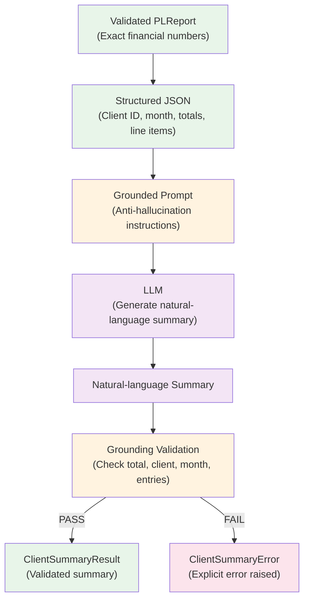

# LLM Boundary — A.05.1 Workflow Automation Agent

This document clearly defines where the LLM is used and where it is intentionally NOT used in the A.05.1 workflow.

---

## LLM Boundary Diagram



**How the LLM is grounded:**
1. Input is structured data from a validated PLReport
2. Prompt includes explicit anti-hallucination instructions
3. Post-generation validation checks that summary contains source facts
4. If validation fails, an explicit error is raised

### Natural-Language Client Summary Generation

| Aspect | Detail |
|--------|--------|
| **Component** | `ClientSummaryGenerator` |
| **Location** | `src/llm/client_summary.py` |
| **Input** | `PLReport` (validated P&L data) |
| **Output** | `ClientSummaryResult` with summary text |
| **Purpose** | Convert structured accounting data into readable client-facing text |
| **Provider** | `FakeLLMClient` (prototype), real LLM provider (production) |

### How the LLM is Used

1. **Input is structured**: The LLM receives a `PLReport` containing exact financial numbers
2. **Prompt includes anti-hallucination instructions**: Explicit rules prevent the LLM from inventing facts
3. **Post-generation validation**: Summary is validated against source PLReport
4. **Explicit failure**: If validation fails, `ClientSummaryError` is raised

### Example Prompt Structure

```
You are a professional accounting assistant generating a client-facing monthly expense summary.

CRITICAL ANTI-HALLUCINATION INSTRUCTIONS:
- Use ONLY the financial facts provided in the structured data below.
- Do NOT invent, estimate, or infer any financial numbers.
...

Structured P&L Data:
    {
      "client_id": "TV-001",
      "month": "2026-08",
      "total_expenses": 4200.50,
      "entry_count": 8,
      "line_items": [...]
    }

Generate a professional summary now. Use the exact numbers from the data above.
```

---

## LLM IS NOT USED FOR

### Expense Categorization

| Aspect | Detail |
|--------|--------|
| **Component** | `categorize_expenses()` |
| **Location** | `src/processors/categorizer.py` |
| **Instead Used** | Deterministic rules (vendor lookup + keyword heuristics) |
| **Why Not LLM** | Classification is deterministic. Vendor → category mapping is exact. LLM would be expensive, non-deterministic, and unnecessary. |

### Receipt Reconciliation

| Aspect | Detail |
|--------|--------|
| **Component** | `reconcile_expenses()` |
| **Location** | `src/processors/reconciler.py` |
| **Instead Used** | Deterministic rules (vendor/amount/date comparison) |
| **Why Not LLM** | Reconciliation is binary comparison. No natural language understanding needed. Rules are faster, cheaper, and deterministic. |

### Anomaly Detection

| Aspect | Detail |
|--------|--------|
| **Component** | `detect_anomalies()` |
| **Location** | `src/decisions/anomaly_detector.py` |
| **Instead Used** | Statistical thresholds + rules |
| **Why Not LLM** | Anomaly detection uses explainable thresholds. HIGH_VALUE = category_mean * multiplier. DUPLICATE = exact match. LLM would be expensive and non-deterministic. Rules are auditable. |

### Financial Calculations

| Aspect | Detail |
|--------|--------|
| **Component** | `Ledger`, `PLGenerator` |
| **Location** | `src/accounting/ledger.py`, `src/accounting/pl_generator.py` |
| **Instead Used** | Deterministic arithmetic |
| **Why Not LLM** | Financial calculations must be exact. LLM can hallucinate numbers. Deterministic arithmetic is reliable and auditable. |

### Ledger Posting

| Aspect | Detail |
|--------|--------|
| **Component** | `Ledger.post_clean_expenses()`, `Ledger.post_human_reviewed()` |
| **Location** | `src/accounting/ledger.py` |
| **Instead Used** | Deterministic rules |
| **Why Not LLM** | Posting rules are deterministic: NORMAL→POSTED, APPROVE→HUMAN_REVIEWED, REJECT→skip. No judgment needed. |

### Human-Review Decisions

| Aspect | Detail |
|--------|--------|
| **Component** | `HumanReviewQueue` |
| **Location** | `src/human_review/review_queue.py` |
| **Instead Used** | Human judgment |
| **Why Not LLM** | Spec explicitly forbids LLM from making approval/rejection decisions. These require human judgment. |

### P&L Generation

| Aspect | Detail |
|--------|--------|
| **Component** | `PLGenerator.generate()` |
| **Location** | `src/accounting/pl_generator.py` |
| **Instead Used** | Deterministic aggregation |
| **Why Not LLM** | P&L is aggregation of ledger entries. No natural language needed. LLM would hallucinate financial numbers. |

---

## Why the LLM Boundary Exists

### 1. Deterministic Decisions Require Deterministic Components

Financial decisions (categorization, reconciliation, calculations) must be reproducible and auditable. LLM outputs are non-deterministic — the same input can produce different outputs on different runs.

### 2. LLM Hallucination Risk

LLMs can invent financial facts that don't exist in the source data. For accounting applications, this is unacceptable. The boundary ensures all financial facts come from deterministic logic.

### 3. Cost Efficiency

LLM calls are expensive (in production). Using LLM for tasks that rules can handle faster and cheaper violates the component assignment principle: "cheapest trustworthy component for each decision."

### 4. Auditability

Deterministic rules produce the same output for the same input every time. This makes the workflow auditable and reproducible — critical for accounting applications.

### 5. Spec Compliance

A05_1_SPEC.md Section 9 explicitly states:

> "LLM is NOT used for deterministic financial decisions."

The LLM boundary implements this requirement.

---

## Validation Evidence

The LLM boundary is enforced by:

1. **Code architecture**: LLM is only imported in `src/llm/client_summary.py`
2. **Interface design**: `ClientSummaryGenerator` only accepts `PLReport` (validated data)
3. **Anti-hallucination validation**: Post-generation checks verify grounding
4. **Test coverage**: Tests verify LLM is not called for other decisions
5. **Routing decisions**: Documented in `docs/routing-decisions.md`

---

## Production Considerations

If migrating to a real LLM provider:

1. **Same boundary applies**: LLM still only used for client summary
2. **Real provider injection**: Pass real `LLMClient` implementation to `ClientSummaryGenerator`
3. **Validation unchanged**: Anti-hallucination checks still apply
4. **Cost monitoring**: Track token usage for cost estimation

---

*Generated: 2026-09-06*
*Phase: 8 — Evidence*
