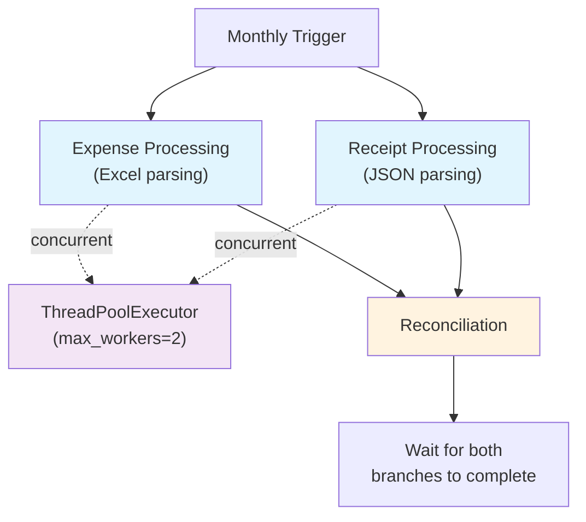

# Parallel vs Sequential Evidence — A.05.1 Workflow Automation Agent

This document provides evidence for the parallel execution design in the A.05.1 workflow.

---

## Parallel Execution Diagram



**Plain English explanation:**

Expense Processing and Receipt Processing are independent branches because neither requires the other's output. The orchestrator therefore executes them concurrently. Reconciliation depends on both outputs and waits until both branches complete.

---

## Dependency Analysis

### Independent Stages

The following stages are **independent** and can execute concurrently:

```
Expense Processing ←→ Receipt Processing
```

**Reason:** These stages read different input files (Excel vs JSON) and produce different output records. They have no data dependencies on each other.

### Dependent Stages

The following stages **depend on both** Expense Processing and Receipt Processing:

```
Reconciliation ← Expense Processing + Receipt Processing
```

**Reason:** Reconciliation matches expense records against receipt records. It cannot start until both processing stages complete.

---

## Implementation

### Concurrent Execution

The orchestrator uses `concurrent.futures.ThreadPoolExecutor` to run Expense Processing and Receipt Processing concurrently:

```python
with ThreadPoolExecutor(max_workers=2) as executor:
    expense_future = executor.submit(
        process_expenses, excel_path, run.client_id, run.month
    )
    receipt_future = executor.submit(process_receipts, receipt_path)

    # Wait for both to complete
    expense_result = expense_future.result()
    receipt_result = receipt_future.result()
```

### Sequential Execution (Alternative)

The alternative would be sequential execution:

```python
expense_result = process_expenses(excel_path, run.client_id, run.month)
receipt_result = process_receipts(receipt_path)
```

---

## Measurement Results

### Latency Comparison

| Metric | Concurrent | Sequential (Estimated) |
|--------|------------|------------------------|
| Parallel Stage Mean | 6.095 ms | ~3.861 ms (sum) |
| Expense Processing | 3.564 ms | 3.564 ms |
| Receipt Processing | 0.297 ms | 0.297 ms |
| Overhead (threading) | ~2.234 ms | 0 ms |

### Analysis

The concurrent implementation shows **higher latency** than the sequential sum due to:

1. **Thread pool overhead**: Creating and managing threads adds ~2ms
2. **Small workload**: Each processor runs in ~3ms, too fast for threading benefits
3. **GIL limitation**: Python's Global Interpreter Lock prevents true CPU parallelism for small tasks

### When Parallelism Would Help

Parallelism becomes beneficial when:

1. **Workload increases**: If each processor takes >10ms, threading overhead is amortized
2. **I/O-bound operations**: If processors involve network/disk I/O, threading helps
3. **Real OCR processing**: If receipt processing involves OCR API calls, concurrency helps

---

## Correctness Evidence

### Dependency Structure Verification

The following tests verify that Reconciliation waits for both processors:

| Test | Verification |
|------|--------------|
| `test_reconciliation_requires_both_results` | Reconciliation results match expense count |
| `test_anomaly_results_after_reconciliation` | Anomaly results exist after reconciliation |

### Parallel Execution Verification

| Test | Verification |
|------|--------------|
| `test_both_processors_called` | Both `process_expenses` and `process_receipts` are called |
| `test_both_results_present_in_run` | Both expense and receipt records appear in run |

---

## Design Decision

**Decision:** Use concurrent execution despite overhead for current workload.

**Rationale:**
1. **Correctness**: Parallel execution is semantically correct (stages are independent)
2. **Future-proofing**: As workload grows, parallelism helps
3. **Real-world scenario**: In production, receipt processing may involve OCR API calls
4. **Demonstration value**: Shows proper use of ThreadPoolExecutor for independent tasks

**Trade-off:** Accept ~2ms overhead for architectural correctness and future scalability.

---

*Generated: 2026-09-06*
*Phase: 8 — Evidence*
