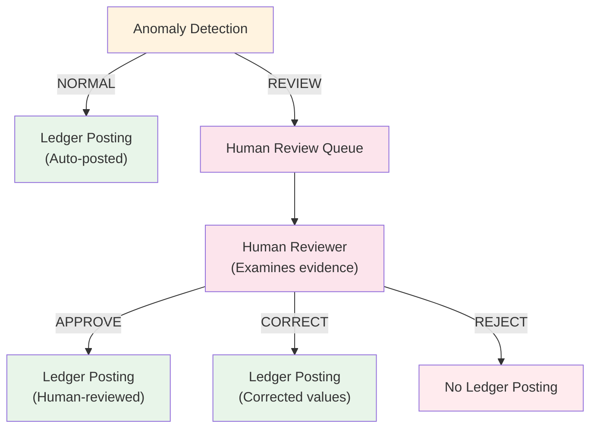

# Routing Decisions — A.05.1 Workflow Automation Agent

This document records the component-assignment decisions for each workflow stage. Each decision explains why a particular component was selected and why alternatives were rejected.

---

## 1. Monthly Trigger

| Field | Value |
|-------|-------|
| **Workflow Decision** | Simulate client submitting monthly expense package |
| **Candidate Components** | Rules, ML, LLM, Tools, Human |
| **Selected Component** | Tools (file generation) |
| **Why Selected** | Trigger is a system operation that creates input artifacts. No judgment or decision-making required. |
| **Why Alternatives Rejected** | Rules: No validation needed at trigger stage. ML: No classification needed. LLM: No natural language needed. Human: No judgment needed. |
| **Cost/Latency** | Minimal — generates synthetic Excel and JSON files |
| **Traceability** | Creates `WorkflowRun` with unique `run_id` for tracking |
| **Human Review** | No |

---

## 2. Expense Parsing (Excel Processing)

| Field | Value |
|-------|-------|
| **Workflow Decision** | Extract structured records from Excel spreadsheet |
| **Candidate Components** | Rules, ML, LLM, Tools |
| **Selected Component** | Rules (schema validation) + Tools (Excel reading) |
| **Why Selected** | Excel parsing is a deterministic operation. Schema validation is rule-based. No ML or LLM needed for structured data extraction. |
| **Why Alternatives Rejected** | ML: No classification or pattern recognition needed. LLM: No natural language understanding needed. Pure parsing is deterministic. |
| **Cost/Latency** | Low — openpyxl reads Excel files efficiently |
| **Traceability** | Each record gets unique `expense_id` (EXP-XXXXXXXX) |
| **Human Review** | No |

---

## 3. Receipt Processing

| Field | Value |
|-------|-------|
| **Workflow Decision** | Extract structured data from receipt files |
| **Candidate Components** | Rules, ML, LLM, Tools |
| **Selected Component** | Rules (validation) + Tools (JSON reading) |
| **Why Selected** | Receipt data is structured JSON. Validation is rule-based. Design allows OCR substitution later without changing interface. |
| **Why Alternatives Rejected** | ML: No pattern recognition needed for structured data. LLM: No natural language understanding needed. Rules + Tools sufficient. |
| **Cost/Latency** | Minimal — JSON parsing is fast |
| **Traceability** | Each receipt gets unique `receipt_id` |
| **Human Review** | No |

---

## 4. Reconciliation

| Field | Value |
|-------|-------|
| **Workflow Decision** | Match expense records against receipt records |
| **Candidate Components** | Rules, ML, LLM |
| **Selected Component** | Rules (deterministic comparison) |
| **Why Selected** | Reconciliation is a binary comparison: vendor match, amount match, date match. No ambiguity requiring ML. No natural language needed. |
| **Why Alternatives Rejected** | ML: No classification needed — comparison is deterministic. LLM: No natural language needed — numerical/string comparison. Rules are cheapest and most reliable for this task. |
| **Cost/Latency** | Low — string similarity and numeric comparison |
| **Traceability** | Each expense gets `ReconciliationResult` with status, reason, and evidence |
| **Human Review** | No — but mismatches feed into anomaly detection |

---

## 5. Categorization

| Field | Value |
|-------|-------|
| **Workflow Decision** | Assign expense categories (Travel, Meals, Software, etc.) |
| **Candidate Components** | Rules, ML, LLM |
| **Selected Component** | Rules (vendor lookup + keyword heuristics) |
| **Why Selected** | All vendors in synthetic data have clear, unambiguous category assignments. Vendor lookup is deterministic and 100% accurate for known vendors. Keyword heuristics handle unknown vendors. |
| **Why Alternatives Rejected** | ML: Would be appropriate if vendors span multiple categories or descriptions are ambiguous. Not needed for current dataset. LLM: Would be expensive and non-deterministic for classification. Rules are sufficient. |
| **Cost/Latency** | Minimal — JSON lookup + string matching |
| **Traceability** | Each expense gets `CategorizationResult` with method (vendor_lookup/keyword_heuristic/unmatched) and confidence |
| **Human Review** | No |
| **Note** | Spec Section 9 states: "Expense categorization (clear cases) → Rules". ML only for ambiguous cases. Current dataset has no ambiguous cases. |

---

## 6. Anomaly Detection

| Field | Value |
|-------|-------|
| **Workflow Decision** | Identify expenses requiring human review |
| **Candidate Components** | Rules, ML, LLM |
| **Selected Component** | Rules + Statistical thresholds |
| **Why Selected** | Anomaly detection uses explainable threshold-based scoring. HIGH_VALUE uses category mean * multiplier. DUPLICATE uses exact match. NEW_VENDOR uses known vendor list. All are deterministic and auditable. |
| **Why Alternatives Rejected** | ML: Would be appropriate for complex pattern detection (e.g., unusual spending patterns over time). Current implementation provides interfaces ready for historical data but uses rules for now. LLM: Would be expensive and non-deterministic. Rules are sufficient and explainable. |
| **Cost/Latency** | Low — statistical aggregation + threshold comparison |
| **Traceability** | Each expense gets `AnomalyResult` with verdict (NORMAL/REVIEW), reasons, explanation, evidence, and threshold used |
| **Human Review** | No — but REVIEW verdicts route to human review queue |
| **Note** | Spec Section 9 states: "Anomaly detection → Statistical ML + Rules". Implementation uses rules + statistical thresholds. ML would be added for historical pattern detection. |

---

## 7. Human Review

**Human review behavior:**
- APPROVE → Posted with `source="human_review"`, `status=HUMAN_REVIEWED`
- CORRECT → Posted with corrected values, `source="human_review"`, `status=HUMAN_REVIEWED`
- REJECT → Not posted (excluded from ledger)

| Field | Value |
|-------|-------|
| **Workflow Decision** | Approve, reject, or correct anomalous expenses |
| **Candidate Components** | Human |
| **Selected Component** | Human |
| **Why Selected** | Reviewing anomalous expenses requires judgment. The human reviewer examines evidence and makes a decision based on domain knowledge. |
| **Why Alternatives Rejected** | Rules: Cannot make judgment calls about whether an anomaly is legitimate. ML: Would require training data on approval/rejection patterns. LLM: Explicitly forbidden from making approval decisions per spec. |
| **Cost/Latency** | High — requires human time |
| **Traceability** | Each decision recorded with: review_id, expense_id, reviewer, decision, reason, timestamp, corrected values |
| **Human Review** | Yes — this IS the human review step |

---

## 8. Ledger Posting

| Field | Value |
|-------|-------|
| **Workflow Decision** | Post expenses to accounting records |
| **Candidate Components** | Rules, Tools |
| **Selected Component** | Rules (posting logic) + Tools (ledger storage) |
| **Why Selected** | Posting rules are deterministic: NORMAL→POSTED, APPROVE→HUMAN_REVIEWED, CORRECT→HUMAN_REVIEWED, REJECT→skip. No judgment needed. |
| **Why Alternatives Rejected** | ML: No classification needed. LLM: No natural language needed. Human: No judgment needed — rules determine posting based on prior decisions. |
| **Cost/Latency** | Minimal — in-memory list operations |
| **Traceability** | Each entry gets sequential `entry_id` (LED-XXXXXXXX) with source (auto/human_review) and status (POSTED/HUMAN_REVIEWED) |
| **Human Review** | No |

---

## 9. P&L Generation

| Field | Value |
|-------|-------|
| **Workflow Decision** | Aggregate ledger entries into monthly P&L report |
| **Candidate Components** | Rules, ML, LLM |
| **Selected Component** | Rules (aggregation) |
| **Why Selected** | P&L generation is deterministic aggregation: sum by category, count entries. No judgment or natural language needed. |
| **Why Alternatives Rejected** | ML: No classification or pattern recognition needed. LLM: Would hallucinate financial numbers. Rules are deterministic and auditable. |
| **Cost/Latency** | Minimal — dictionary aggregation |
| **Traceability** | `PLReport` contains exact numbers from ledger entries. Each line item has category, total, count. |
| **Human Review** | No |

---

## 10. Client Summary Generation

| Field | Value |
|-------|-------|
| **Workflow Decision** | Convert P&L data into natural-language client summary |
| **Candidate Components** | Rules, ML, LLM |
| **Selected Component** | LLM (natural-language generation) |
| **Why Selected** | Natural-language generation is the LLM's core strength. The prompt provides structured P&L data. Anti-hallucination validation ensures grounding. |
| **Why Alternatives Rejected** | Rules: Would produce templated, robotic output. ML: Not designed for text generation. LLM is the cheapest trustworthy component for NLG. |
| **Cost/Latency** | Medium — LLM call (simulated with FakeLLMClient in prototype) |
| **Traceability** | `ClientSummaryResult` records: model_used, validation_passed, validation_errors, source_report_generated_at |
| **Human Review** | No — but validation acts as quality gate |

---

## Summary Table

| # | Decision | Component | ML/LLM? | Human? |
|---|----------|-----------|---------|--------|
| 1 | Monthly trigger | Tools | No | No |
| 2 | Expense parsing | Rules + Tools | No | No |
| 3 | Receipt processing | Rules + Tools | No | No |
| 4 | Reconciliation | Rules | No | No |
| 5 | Categorization | Rules | No | No |
| 6 | Anomaly detection | Rules + Statistical | No | No |
| 7 | Human review | Human | No | Yes |
| 8 | Ledger posting | Rules + Tools | No | No |
| 9 | P&L generation | Rules | No | No |
| 10 | Client summary | LLM | LLM | No |

---

## Key Principle: LLM is NOT Used for Deterministic Financial Decisions

The LLM is used for exactly ONE task: natural-language client summary generation.

The LLM is NOT used for:
- Expense categorization
- Receipt reconciliation
- Anomaly detection
- Financial calculations
- Ledger posting
- Human-review decisions
- P&L generation

All financial decisions are made by deterministic rules or human judgment. The LLM only converts structured data into readable text.

---

*Generated: 2026-09-06*
*Phase: 8 — Evidence*
